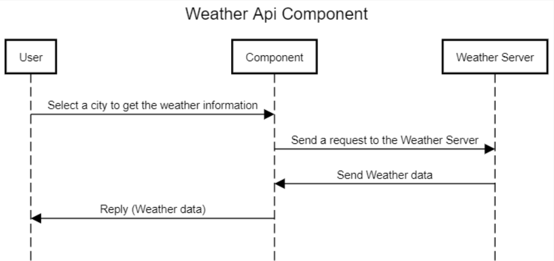

# APIWeatherApp 
The application is developed with MVVM Architecture using Kotlin language and Retrofit network library. It is divided into two parts:
- A shared module (library)
- A User interface app

The component was integrated as a separate module in the app (Android Library) to be used in the second part (User interface part) by adding a dependency to the "app" build.gradle with the following line:

implementation project(':shared').
 
 The OpenWeatherMap service was consumed using:
 - Retrofit 
 - Gson for Parsing
  
 As a feature, I will add offline mode using Room database.
 
Module description:
After selecting a city by the user, the app will call the library component (shared) to send a request to the Open Weather Map api. The api will then return a response to the library
to be parsed and converted to a weather information model to be finally displayed to the user.

This scenario is presented in the following sequence diagram:

